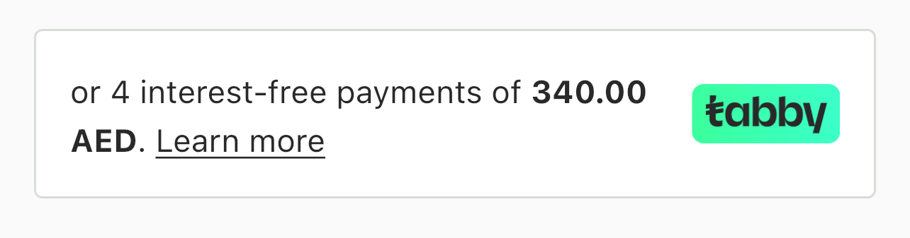
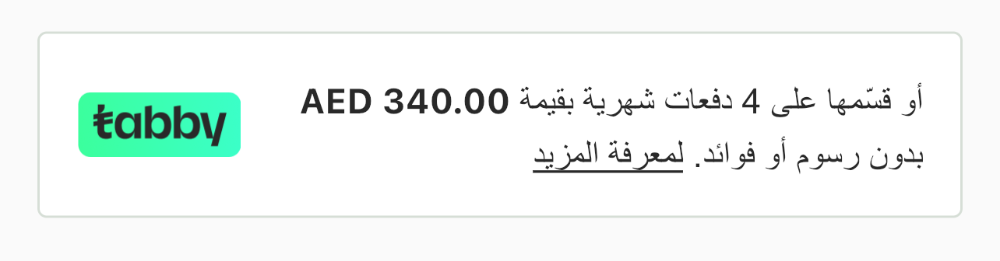

# Tabby Flutter SDK

Use the Tabby checkout in your Flutter app.

## Requirements

- Dart sdk: `">=2.15.0 <4.0.0"`
- Flutter: `">=2.5.0"`
- Android: `minSdkVersion 17` and add support for `androidx` (see [AndroidX Migration](https://flutter.dev/docs/development/androidx-migration) to migrate an existing app)
- iOS: `--ios-language swift`, Xcode version `>= 12`

## 1️⃣ Adding Android and iOS-specific configuration

#### Why this is even needed?
We use `webview_flutter` and `permission_handler` as a dependencies.

Tabby might ask user to go through a verification process, which requires live check with camera and and that's why we need to ask for camera permission.

Camera permission is needed to take ID card photo for KYC process.

To enable WebView to use the camera for KYC process, you need to:


## On iOS please make sure you've added in your `Info.plist`

Feel free to edit descriptions according to your App

```xml
<key>NSCameraUsageDescription</key>
<string>This allows Tabby to take a photo of an ID</string>
<key>NSMicrophoneUsageDescription</key>
<string>This allows Tabby to perform a live check during a KYC process</string>
```

While the permissions are being requested during runtime, you'll still need to tell the OS which permissions your app might potentially use. That requires adding permission configuration to iOS-specific files.

The `permission_handler` plugin use macros to control whether a permission is enabled.

## Please also make sure you've edited your `post_install` script in your app `Podfile` to include the following:

```ruby
post_install do |installer|
  installer.pods_project.targets.each do |target|
    flutter_additional_ios_build_settings(target)

    target.build_configurations.each do |config|
      # You can remove unused permissions here
      # for more information: https://github.com/Baseflow/flutter-permission-handler/blob/main/permission_handler_apple/ios/Classes/PermissionHandlerEnums.h
      # e.g. when you don't need camera permission, just add 'PERMISSION_CAMERA=0'
      config.build_settings['GCC_PREPROCESSOR_DEFINITIONS'] ||= [
        '$(inherited)',
        ## dart: PermissionGroup.camera
        'PERMISSION_CAMERA=1',
        ## dart: PermissionGroup.microphone
        'PERMISSION_MICROPHONE=1',
      ]
    end
  end
end
```

For any clarification, please refer to the [permission_handler](https://pub.dev/packages/permission_handler) plugin documentation.

## On Android please make sure you've added in your `AndroidManifest.xml`

```xml
<uses-permission android:name="android.permission.CAMERA"/>
<uses-permission android:name="android.permission.RECORD_AUDIO" />
<uses-permission android:name="android.permission.MODIFY_AUDIO_SETTINGS" />
<uses-permission android:name="android.permission.VIDEO_CAPTURE" />
<uses-permission android:name="android.permission.AUDIO_CAPTURE" />
```


## 2️⃣ Usage

1. You should initialise Tabby SDK. We recommend to do it in `main.dart` file:

```dart
  // ⚠️ Since 2.0.0, setup() is async. Await it before using any other SDK API.
  await TabbySDK().setup(
    withApiKey: '', // Put here your Api key, given by the Tabby integrations team
  );
```

> **Migrating from 1.x:** `TabbySDK().setup(...)` now returns a `Future<void>` because the SDK fetches sharded base URLs from `/api/v1/sdk/config` during initialisation. Add `await` in front of the call and surface failures (network errors, malformed config) before navigating into checkout-dependent screens — that's the whole migration.

2. Create checkout session:

```dart
  final mockPayload = Payment(
    amount: '340',
    currency: Currency.aed,
    buyer: Buyer(
      email: 'card.success@tabby.ai', // use otp.success@tabby.ai to test rejection case
      phone: '500000001', // use 500000002 to test rejection case
      name: 'Yazan Khalid',
      dob: '2019-08-24',
    ),
    buyerHistory: BuyerHistory(
      loyaltyLevel: 0,
      registeredSince: '2019-08-24T14:15:22Z',
      wishlistCount: 0,
    ),
    shippingAddress: const ShippingAddress(
      city: 'string',
      address: 'string',
      zip: 'string',
    ),
    order: Order(referenceId: 'id123', items: [
      OrderItem(
        title: 'Jersey',
        description: 'Jersey',
        quantity: 1,
        unitPrice: '10.00',
        referenceId: 'uuid',
        productUrl: 'http://example.com',
        category: 'clothes',
      )
    ]),
    orderHistory: [
      OrderHistoryItem(
        purchasedAt: '2019-08-24T14:15:22Z',
        amount: '10.00',
        paymentMethod: OrderHistoryItemPaymentMethod.card,
        status: OrderHistoryItemStatus.newOne,
      )
    ],
  );

  final session = await TabbySDK().createSession(TabbyCheckoutPayload(
    merchantCode: 'ae', // pay attention, this might be different for different merchants
    lang: Lang.en,
    payment: mockPayload,
  ));
```

3. Check session.status is different from `SessionStatus.rejected` and then open the in-app browser to show checkout:

```dart
  void openInAppBrowser() {
    if (session.status == SessionStatus.rejected) {
      final rejectionText =
          lang == Lang.ar ? TabbySDK.rejectionTextAr : TabbySDK.rejectionTextEn;
      ScaffoldMessenger.of(context).showSnackBar(
        SnackBar(
          content: Text(rejectionText),
        ),
      );
      return;
    }
    TabbyWebView.showWebView(
      context: context,
      webUrl: session.availableProducts.installments.webUrl,
      onResult: (WebViewResult resultCode) {
        print(resultCode.name);
        // TODO: Process resultCode
        // The sheet stays open until you close it yourself,
        // e.g. Navigator.pop(context);
      },
    );
  }
```

If you prefer to `await` the checkout outcome instead of handling callbacks, use `showWebViewAsync`:

```dart
  Future<void> openInAppBrowser() async {
    final resultCode = await TabbyWebView.showWebViewAsync(
      context: context,
      webUrl: session.availableProducts.installments.webUrl,
    );
    // The SDK closes the sheet automatically once the first result arrives.
    switch (resultCode) {
      case WebViewResult.authorized:
        // Payment authorized — navigate to your order completion screen
        break;
      case WebViewResult.rejected:
      case WebViewResult.expired:
      case WebViewResult.close:
        // Handle unsuccessful outcomes
        break;
      case null:
        // The sheet was dismissed before checkout produced a result
        break;
    }
  }
```

#### `showWebView` vs `showWebViewAsync` — which one to pick?

| | `showWebView` | `showWebViewAsync` |
|---|---|---|
| Result delivery | `onResult` callback, fired for every checkout event | Returned `Future<WebViewResult?>` (first result wins); optional `onResult` is also called |
| Sheet lifecycle | You close the sheet yourself (e.g. `Navigator.pop` inside `onResult`) | SDK closes the sheet automatically on the first result |
| Dismissed without a result | `onResult` is simply never called | Future resolves with `null` |

Use `showWebViewAsync` for the common "open checkout, wait for the outcome, continue" flow. Use `showWebView` when you need full control over the sheet lifecycle — for example, to keep the sheet open and recover in place when a session expires.

Do not `await` `showWebView` — it returns `void` by design; the awaitable variant is `showWebViewAsync`.

Also you can use TabbyWebView as inline widget on your page:

```dart
  @override
  Widget build(BuildContext context) {
    return Scaffold(
      appBar: AppBar(
        title: const Text('Tabby Checkout'),
      ),
      body: TabbyWebView(
        webUrl: session.availableProducts.installments.webUrl,
        onResult: (WebViewResult resultCode) {
          print(resultCode.name);
          // TODO: Process resultCode
          switch (resultCode) {
            case WebViewResult.authorized:
            // Do something when Tabby authorized customer:
            // you might want to navigate back to Home screen or any Order Completion screen,
            // do any fetching from your backend,
            // or notify user on successfull order
              break;
            case WebViewResult.close:
            // Do something else when customer closes Tabby checkout
              break;
            case WebViewResult.expired:
            // Do something else when session expired
            // We strongly recommend creating a new session by calling
            // await Tabby.createSession(myTestPayment)
              break;
            case WebViewResult.rejected:
            // Do something else when Tabby rejected customer due to scoring, KYC, etc.
              break;
          }
        },
      ),
    );
  }
```

### TabbyPresentationSnippet

<p>
  
  
</p>

For show `TabbyPresentationSnippet` you can add as inline widget on your page:

```dart
  TabbyPresentationSnippet(
    price: mockPayload.amount,
    currency: mockPayload.currency,
    lang: lang,
  )
```

## Example project

You can also check the [example project](https://github.com/tabby-ai/tabby-flutter-sdk/tree/master/example).
